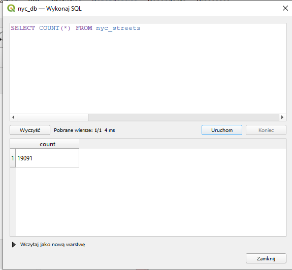
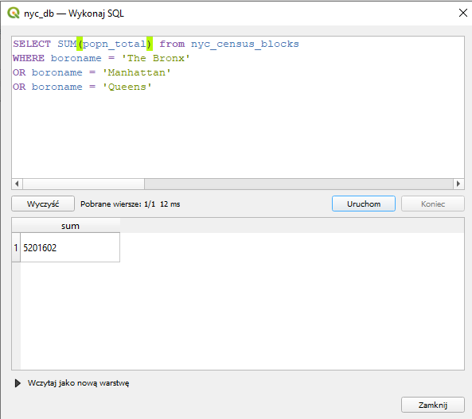

## Rozwiązanie 11 laboratorium z przedmiotu Analiza i Bazy Danych  

Najtrudniejszą częścią ćwiczenia, była konfiguracja wszystkich potrzebnych narzędzi. Początkowo chciałem wykonać laboratorium na systemie Linux w dystrybucji Ubuntu.
Niesetety natknąłem się na wiele problemów z którymi sobie nie dałem rady. Przez to zdecydowałem się przenieść na system Windows. Tutaj nie licząć kilku drobnych problemów,
poszło całkiem sprawnie. Finalnie moim oczom ujrzał się skonfigurowany i połączony z bazą danych program QGIS  
   
Sprawdzenie, czy instalacja postgisa się powiodła, można było sprawdzić zgodnie z komendą podaną w instruckji. W moim przypadku uzyskałem taki efekt:  
   
Przechodząc do zapytań, otrzymałem następujące wyniki:  
1. Ile rekordów znajduje się w tabeli nyc_streets?  
   

2. Ile ulic w Nowym Jorku ma nazwy zaczynające się na „B”, „Q” i „M”?  
   

3. Jaka jest populacja miasta Nowy Jork?  
   

4. Jaka jest populacja Bronxu, Manhattanu i Queens?  
   

5. Ile dzielnic ("neighborhoods") znajduje się w każdej gminie (borough)?  
   

