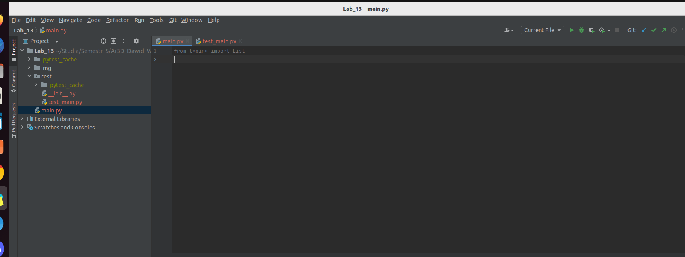
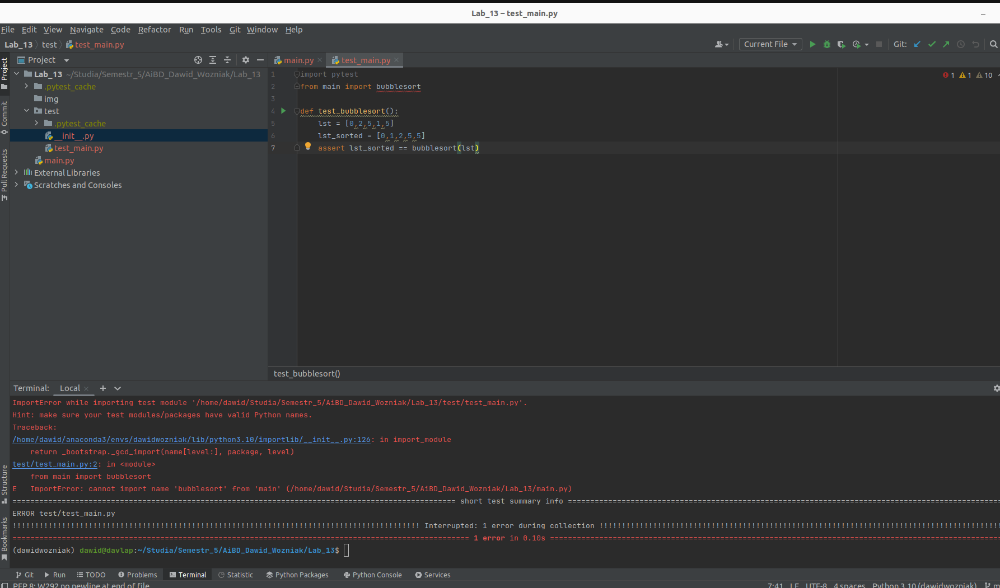
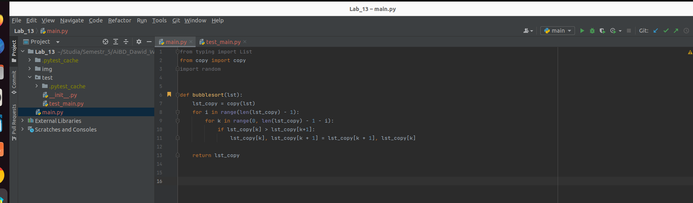
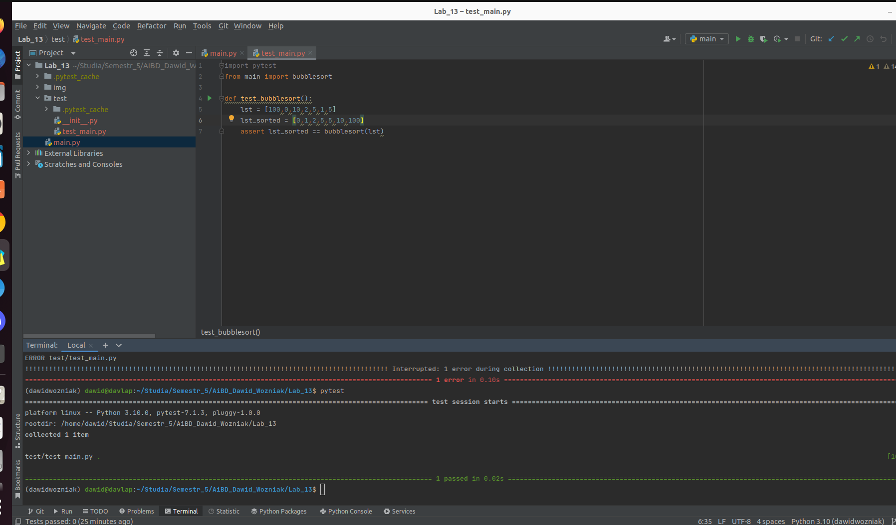
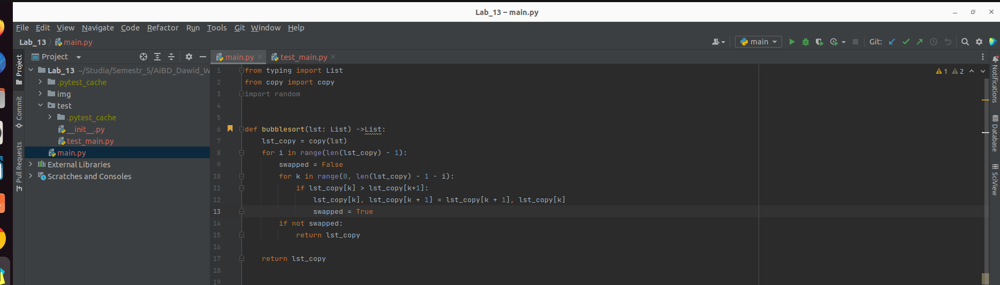
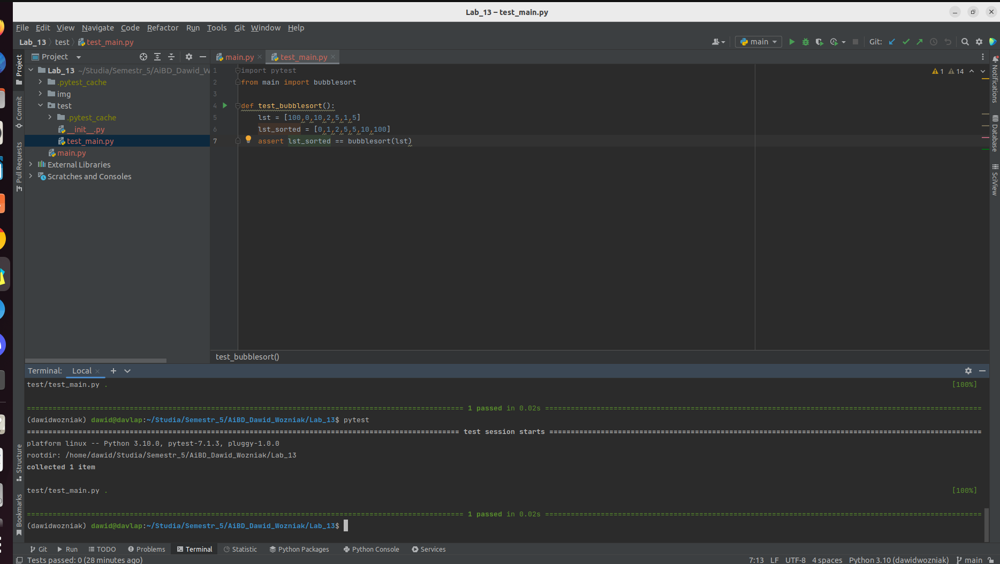

## Rozwiązanie 13 laboratorium z przedmiotu Analiza i Bazy Danych  

Ćwiczenie przebiegło sprwanie i przyjemnie, oprócz jednego problemu z konfliktem w moim repozytorium. Screeny z poszczególnych części umieszczam poniżej  

## Faza red 

Zawartość pliku main w fazie red    
   
Wynik testu w fazie red   
   

## Faza green 

Zawartość pliku main w fazie green    
   
Wynik testu w fazie green   
   

## Faza refactor 

Zawartość pliku main w fazie refactor    
   
Wynik testu w fazie refactor   
   

