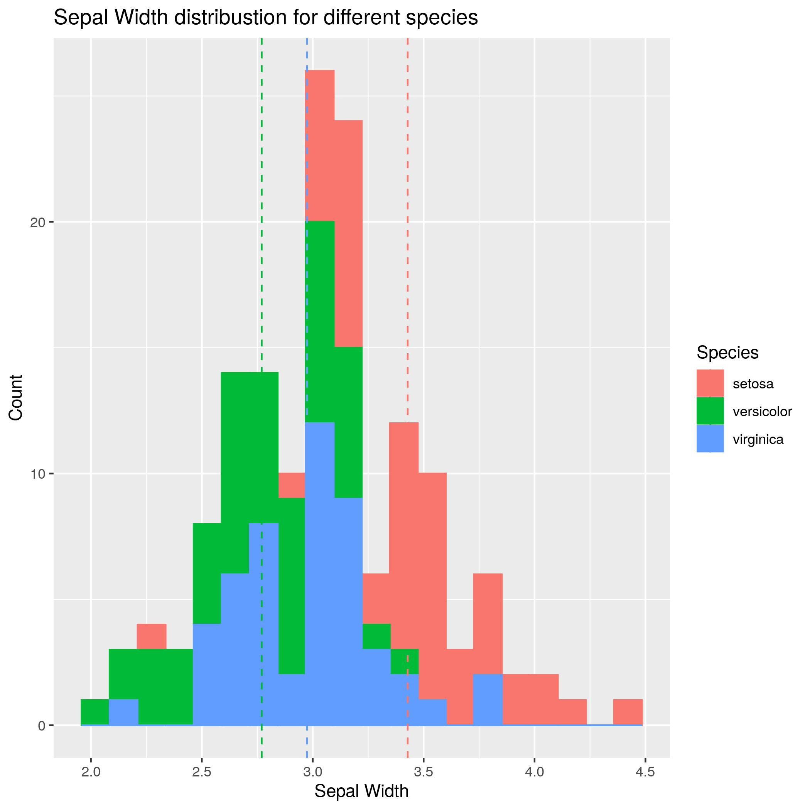
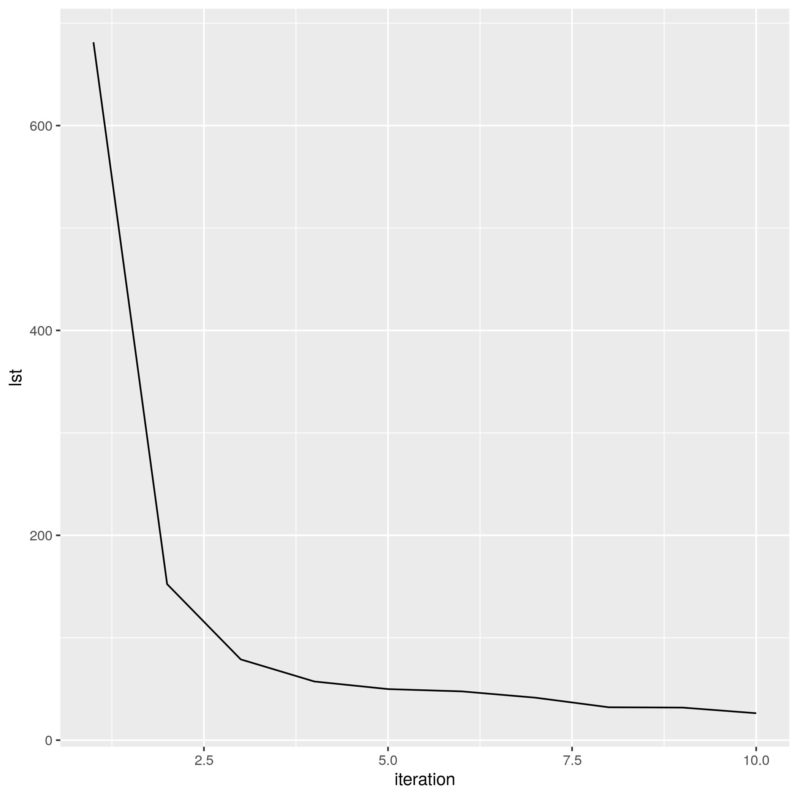
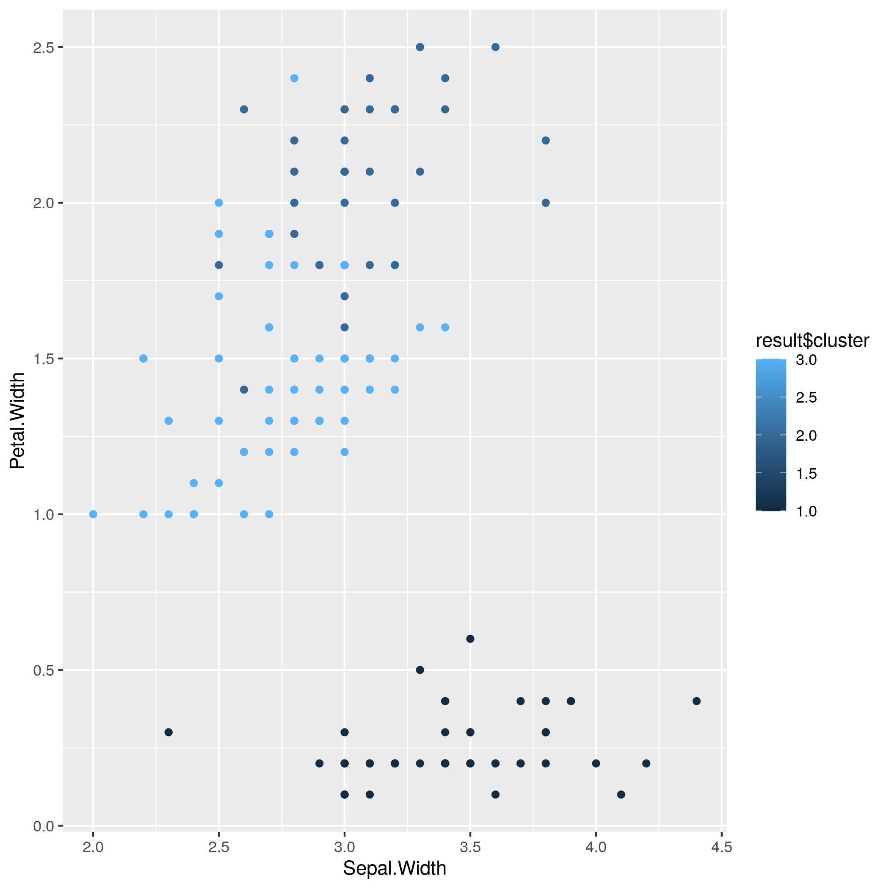
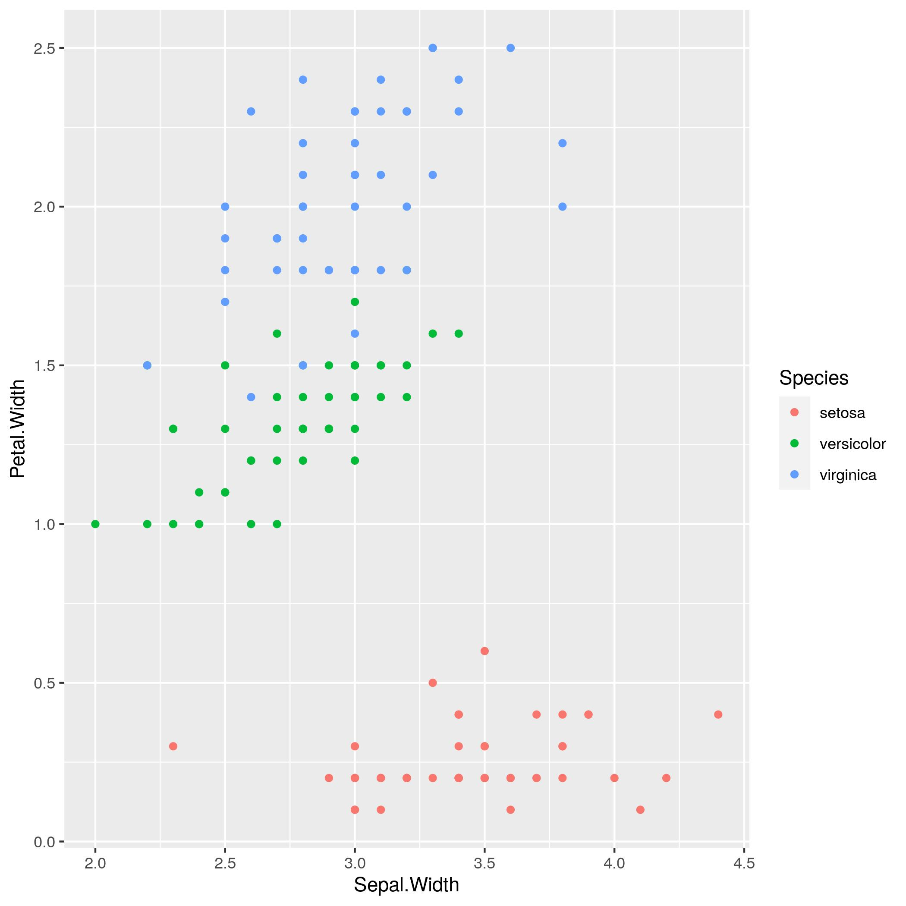

## Rozwiązanie 14 laboratorium z przedmiotu Analiza i Bazy Danych 
Poniżej umieszczam wykresy, które uzyskałem podczas wykonywania laboratorium.

  Zadanie 2 wykres pierwszy  
   
     

Zadanie 2 wykres drugi  
   

Zadanie 3 wykres pierwszy  
   

     
Zadanie 3 wykres drugi  
   

    
 

Zadanie 3 wykres trzeci  
   

